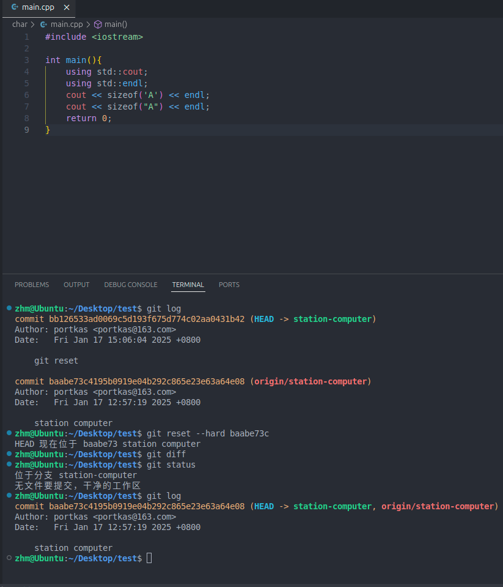

1. git核心概念
2. 整体流程
3. 分析
4. 命令大全

<!-- more -->

# git核心概念

- 工作目录：项目目录；
- 暂存区：准备下次提交的文件列表；
- 仓库：存储项目历史记录的地方，可以是本地的，也可以是远程服务器上的；
- 本地仓库：本地电脑存储历史记录的区域；
- 远程仓库：托管在服务器上的代码副本；


# 整体流程

## 基础操作

### 1. 创建仓库

使用当前目录作为Git仓库：

```bash
$ git init
```

该命令执行完后会在当前目录生成一个.git目录。


### 2. 新建本地文件

本地增加文件url.c、README.md，使用git status查看文件状态，有2个未跟踪的在文件


### 3. 提交文件到暂存区

```bash
$ git add .
```

添加所有文件到暂存区。

### 4. 提交改动

```bash
$ git commit -m "代码提交信息"
```


新增的两个文件，已经提交到HEAD，但是还没到远端仓库。

### 5. 推送到远端仓库

```bash
$ git push origin master
```

如果你还没有克隆现有仓库，并欲将你的仓库 连接到某个远程服务器 ，你可以使用如下命令添加：

```bash
git remote add origin <server>
```

这样就可以将改动推送到所添加的服务器上了。


## 分支操作

分支是用来将特性开发绝缘开来的，在创建仓库的时候，master时默认的分支。

在其他分支上进行开发，完成后再将它们合并到主分支上。

### 1. 查看分支

```bash
$ git branch
```

没有参数时，git branch会列出在本地的分支。


### 2. 创建分支

```bash
$ git branch new-branch-name
```


1. 多了一个分支test
2. 当前分支为主分支master，前面的*表示活动分支

### 3. 切换分支

刚刚的branch命令只是单纯的创建一个新分支。使用checkout命令来更改分支：

```bash
$ git checkout test
```

或者使用以下命令，创建一个分支并同时切换过去（相当于上面两步合在一起)：

```bash
$ git checkout -b test
```

### 4. 分支合并

在分支test上进行修改并提交，当分支任务完成后，切换到主分支并合并：

```bash
$ git checkout master
$ git merge test
```


1. 合并之后可以看到，主分支多了一个新的commit
2. 对其他分支的更改不会反映在主分支上。如果想将更改提交到主分支，则需切换回master分支，然后使用合并。

### 5. 删除分支

```bash
git branch -d test
git branch -D test
```


## 替换本地改动

如果操作失误，可以使用如下命令替换掉本地改动：

```bash
$ git checkout <filename>
```

此命令会使用HEAD中的最新内容替换掉当前工作目录中的文件，已添加到暂存区的改动以及新文件不会受到影响。


当我修改了一个文件，该文件还没有提交到暂存区，我想撤回修改，则可以执行该命令。

> 假如想丢弃在本地的所有改动与提交，可以到服务器上获取最新的版本历史，并将本地主分支指向它：

```bash
$ git fetch origin
$ git reset --hard origin/master
```


## 重置

当我们不想要之前提交的修改时，就会用到这个命令，比如一个错误的提交或者引入一个bug的提交，这个时候就可以使用命令：`git reset`，它可以让我们不再使用当前台面上的文件，让我们可以控制HEAD应该指向的位置。

### 1. 软重置

软重置会将HEAD移动至指定的提交，而不会移除该提交之后加入的修改；


通过 `git status`可以看到，仍然可以访问到在之前提交上做过的修改，可以修复这些文件，之后再重新提交。

### 2. 硬重置

有时候我们并不想保留特定提交引入的修改，且再也不需要访问他们了，Git应该直接将整体状态直接重置到特定提交之前的状态：包括在工作目录中和暂存文件上的修改。



可以看到所有提交的信息都已经被移除了，工作区文件恢复到恢复到特定状态，打开文件可以看到所有添加的信息都不存在了。


# 分析

```bash
$ git branch
* station-computer

$ git branch -a
* station-computer
  remotes/origin/master
  remotes/origin/station-computer
  remotes/origin/zhm-old-computer
```

当前本地仓库只有一个名为 `station-computer`的分支，并且处于激活状态；

远程仓库 `origin`有三个分支：`master`，`station-computer`，`zhm-old-computer`；

### 1. 为什么 `git branch`只显示一个本地分支？

`git branch`命令默认只显示本地分支，在当前仓库中，只有一个本地分支 `station-computer`;


### 2. 如何操作其他远程分支？

#### 操作远程 `master`分支

1. 创建并切换到本地 `master`分支

   ```bash
   $ git checkout -b master origin/master
   ```

   这条命令会在本地创建一个新的 `master`分支，并将其与远程 `master`分支建立跟踪关系，然后切换到该分支。
2. 拉取远程 `master`分支的最新变更

   ```bash
   $ git push origin master
   ```

   这条命令会拉取远程 `master`分支的最新变更并合并到本地 `master`分支。

#### 操作远程 `zhm-old-computer`分支

1. 创建并切换到本地 `zhm-old-computer`分支

   ```bash
   $ git checkout -b zhm-old-computer origin/zhm-old-computer
   ```

   这条命令会在本地创建一个新的 `zhm-old-computer`分支，并将其与远程的 `zhm-old-computer`分支建立跟踪关系，然后切换到该分支。
2. 拉取远程 `zhm-old-computer`分支的最新变更

   ```bash
   $ git pull origin zhm-old-computer
   ```

   这条命令会拉取远程 `zhm-old-computer`分支的最新变更并合并到本地 `zhm-old-computer`分支。

### 3. 其他操作

- 删除远程分支
  ```bash
  $ git push origin --delete master
  $ git push origin --delete zhm-old-computer
  ```


# 命令大全

### 1. 仓库

```bash
# 在当前目录新建一个Git代码库
$ git init

# 新建一个目录，将其初始化为Git代码库
$ git init [project-name]

# 下载一个项目和它的整个代码历史
$ git clone [url]
```


### 2. 配置

```bash
# 显示当前的Git配置
$ git config --list

# 编辑Git配置文件
$ git config -e [--global]

# 设置提交代码时的用户信息
$ git config [--global] user.name "[name]"
$ git config [--global] user.email "[email address]"
```


### 3. 增加/删除文件

```bash
# 添加指定文件到暂存区
$ git add [file1] [file2] ...

# 添加指定目录到暂存区，包括子目录
$ git add [dir]

# 添加当前目录的所有文件到暂存区
$ git add .

# 添加每个变化前，都会要求确认
# 对于同一个文件的多处变化，可以实现分次提交
$ git add -p

# 删除工作区文件，并且将这次删除放入暂存区
$ git rm [file1] [file2] ...

# 停止追踪指定文件，但该文件会保留在工作区
$ git rm --cached [file]

# 改名文件，并且将这个改名放入暂存区
$ git mv [file-original] [file-renamed]
```


### 4. 代码提交

```bash
# 提交暂存区到仓库区
$ git commit -m [message]

# 提交暂存区的指定文件到仓库区
$ git commit [file1] [file2] ... -m [message]

# 提交工作区自上次commit之后的变化，直接到仓库区
$ git commit -a

# 提交时显示所有diff信息
$ git commit -v

# 使用一次新的commit，替代上一次提交
# 如果代码没有任何新变化，则用来改写上一次commit的提交信息
$ git commit --amend -m [message]

# 重做上一次commit，并包括指定文件的新变化
$ git commit --amend [file1] [file2] ...
```


### 5. 分支

```bash
# 列出所有本地分支
$ git branch

# 列出所有远程分支
$ git branch -r

# 列出所有本地分支和远程分支
$ git branch -a

# 新建一个分支，但依然停留在当前分支
$ git branch [branch-name]

# 新建一个分支，并切换到该分支
$ git checkout -b [branch]

# 新建一个分支，指向指定commit
$ git branch [branch] [commit]

# 新建一个分支，与指定的远程分支建立追踪关系
$ git branch --track [branch] [remote-branch]

# 切换到指定分支，并更新工作区
$ git checkout [branch-name]

# 切换到上一个分支
$ git checkout -

# 建立追踪关系，在现有分支与指定的远程分支之间
$ git branch --set-upstream [branch] [remote-branch]

# 合并指定分支到当前分支
$ git merge [branch]

# 选择一个commit，合并进当前分支
$ git cherry-pick [commit]

# 删除分支
$ git branch -d [branch-name]

# 删除远程分支
$ git push origin --delete [branch-name]
$ git branch -dr [remote/branch]
```


### 6. 标签

```bash
# 列出所有tag
$ git tag

# 新建一个tag在当前commit
$ git tag [tag]

# 新建一个tag在指定commit
$ git tag [tag] [commit]

# 删除本地tag
$ git tag -d [tag]

# 删除远程tag
$ git push origin :refs/tags/[tagName]

# 查看tag信息
$ git show [tag]

# 提交指定tag
$ git push [remote] [tag]

# 提交所有tag
$ git push [remote] --tags

# 新建一个分支，指向某个tag
$ git checkout -b [branch] [tag]
```


### 7. 查看信息

```bash
# 显示有变更的文件
$ git status

# 显示当前分支的版本历史
$ git log

# 显示commit历史，以及每次commit发生变更的文件
$ git log --stat

# 搜索提交历史，根据关键词
$ git log -S [keyword]

# 显示某个commit之后的所有变动，每个commit占据一行
$ git log [tag] HEAD --pretty=format:%s

# 显示某个commit之后的所有变动，其"提交说明"必须符合搜索条件
$ git log [tag] HEAD --grep feature

# 显示某个文件的版本历史，包括文件改名
$ git log --follow [file]
$ git whatchanged [file]

# 显示指定文件相关的每一次diff
$ git log -p [file]

# 显示过去5次提交
$ git log -5 --pretty --oneline

# 显示所有提交过的用户，按提交次数排序
$ git shortlog -sn

# 显示指定文件是什么人在什么时间修改过
$ git blame [file]

# 显示暂存区和工作区的差异
$ git diff

# 显示暂存区和上一个commit的差异
$ git diff --cached [file]

# 显示工作区与当前分支最新commit之间的差异
$ git diff HEAD

# 显示两次提交之间的差异
$ git diff [first-branch]...[second-branch]

# 显示今天你写了多少行代码
$ git diff --shortstat "@{0 day ago}"

# 显示某次提交的元数据和内容变化
$ git show [commit]

# 显示某次提交发生变化的文件
$ git show --name-only [commit]

# 显示某次提交时，某个文件的内容
$ git show [commit]:[filename]

# 显示当前分支的最近几次提交
$ git reflog
```


### 8. 远程同步

```bash
# 下载远程仓库的所有变动
$ git fetch [remote]

# 显示所有远程仓库
$ git remote -v

# 显示某个远程仓库的信息
$ git remote show [remote]

# 增加一个新的远程仓库，并命名
$ git remote add [shortname] [url]

# 取回远程仓库的变化，并与本地分支合并
$ git pull [remote] [branch]

# 上传本地指定分支到远程仓库
$ git push [remote] [branch]

# 强行推送当前分支到远程仓库，即使有冲突
$ git push [remote] --force

# 推送所有分支到远程仓库
$ git push [remote] --all
```


### 9.撤销

```bash
# 恢复暂存区的指定文件到工作区
$ git checkout [file]

# 恢复某个commit的指定文件到暂存区和工作区
$ git checkout [commit] [file]

# 恢复暂存区的所有文件到工作区
$ git checkout .

# 重置暂存区的指定文件，与上一次commit保持一致，但工作区不变
$ git reset [file]

# 重置暂存区与工作区，与上一次commit保持一致
$ git reset --hard

# 重置当前分支的指针为指定commit，同时重置暂存区，但工作区不变
$ git reset [commit]

# 重置当前分支的HEAD为指定commit，同时重置暂存区和工作区，与指定commit一致
$ git reset --hard [commit]

# 重置当前HEAD为指定commit，但保持暂存区和工作区不变
$ git reset --keep [commit]

# 新建一个commit，用来撤销指定commit
# 后者的所有变化都将被前者抵消，并且应用到当前分支
$ git revert [commit]

# 暂时将未提交的变化移除，稍后再移入
$ git stash
$ git stash pop
```


### 10. 其他

```bash
# 生成一个可供发布的压缩包
$ git archive
```
