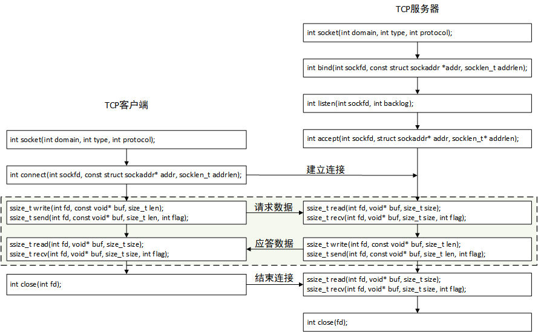
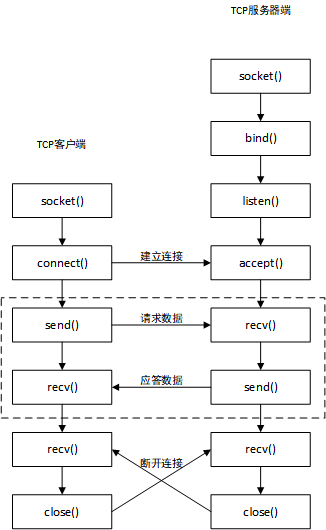

# 多客户端通讯问题

- 多线程
- 多进程
- IO转接+多线程
- libevent

<!-- more -->

# IP

```bash
# Linux
$ ifconfig

# Windows
$ ipconfig

# 测试网络
$ ping www.baidu.com
```

# socket

socket是用于连接客户端和服务器进程的中间件。二者通过socket向网络发出请求或者回应，完成通信过程。

- 流式套接字（SOCK_STREAM）
- 数据报套接字（SOCK_DGRAM）
- 原始套接字（SOCK_RAW）

服务端（server）：建立socket，申明自身的IP和Port并绑定到socket，使用listen监听，然后不断用accept去查看是否有连接。如果有，捕获socket并通过recv获取消息的内容，完成通信之后调用close关闭对应的accept到的socket。

客户端（client）：建立socket，通过IP和Port确定目标服务器，使用connect连接到服务器，send发送消息，等待处理，完成通信后调用close关闭socket。

# socket编程

端口是定位主机上某一个进程的。unsigned short（0-65535）
计算机中所有的进程都需要关联一个端口吗？一个端口可以被重复使用吗？

1. 不需要，如果这个进程不需要进行网络通信，那么进程就不需要绑定端口。
2. 一个端口只能给某一个进程使用，多个进程不能够同时使用同一个端口。

网络分层模型：

- 接口层
- 网络层（IP）
- 传输层（TCP/UDP）
- 应用层（HTTP）

网络通信中三个重要的组成部分：

- 服务器
- 客户端
- IP，端口，通信数据

字节序：

- 大端（网络字节序）：数据低位存内存高位
- 小端（主机字节序）：数据低位存内存低位

```
例如：0x12345678
大端：0x12345678
小端：0x78563412
```

## 字节序转换函数

```C
#include <arpa/inet.h>
// 主机字节序转网络字节序（小端转大端）
uint16_t htons(uint16_t hostshort);
uint32_t htonl(uint32_t hostlong);

// 网络字节序转主机字节序（大端转小端）
uint16_t ntohs(uint16_t netshort);
uint32_t ntohl(uint32_t netlong);
```

IPv4是32位的（uint32_t）
端口是16位的（uint16_t）

## IP地址转换

IP地址本质上是一个整型数，但是在使用中是通过一个字符串来描述的。

```C
#include <arpa/inet.h>
// 主机字节序的IP地址转换为网络字节序IP地址
// 主机字节序的IP地址是一个字符串
// 网络字节序的IP地址是一个整型
int inet_pton(int af, const char* src, void* dst);
```

1. 参数
   - af：地址族协议
     - AF_INET：ipv4
     - AF_INET6：ipv6
   - src：传入参数，点分十进制的ip地址
   - dst：传出参数，大端整型IP
2. 返回值：成功返回1，失败返回0/-1

```C
#include <arpa/inet.h>
// 网络字节序IP地址转换为主机字节序IP地址
const char* inet_ntop(int af, const void* src, char *dst, socklen_t size);
```

1. 参数
   - af：地址族协议
     - AF_INET：ipv4
     - AF_INET6：ipv6
   - src：传入参数,这个指针指向的内存中存储了大端的整形IP地址
   - dst：传出参数,存储转换得到的小端的点分十进制的IP地址
   - size: 修饰dst参数的,标记dst指向的内存中最多可以存储多少个字节
2. 返回值：
   - 成功: 指针指向第三个参数对应的内存地址,通过返回值也可以直接取出转换得到的IP字符串。
   - 失败：返回NULL

## TCP通信流程

TCP是一个面向连接的，安全的，流式传输协议。（传输层协议）

- 面向连接：是一个双向连接，通过三次握手完成连接，通过四次挥手断开连接；
- 安全：TCP通信过程中，会对发送的每一个数据包进行校验，如果发现数据丢失，会自动重传；
- 流式传输：发送端和接收端处理数据的速度，数据的量都可以不一致。





### 服务器通信流程

1. 创建用于监听的套接字（一个文件描述符）
   * socket()
2. 将得到的用于监听的文件描述符和本地IP端口进行绑定
   * bind()
3. 设置监听（监听的是客户端的连接）
   * listen()
4. 等待并接受客户端的连接请求，建立新的连接，会得到一个新的文件描述符（通信的文件描述符），没有新的连接请求就阻塞
   * accept()
5. 通信，读写操作默认都是阻塞的
   * read()/recv()
   * write()/send()
6. 断开连接，关闭套接字
   * close()

### 客户端通信流程

1. 创建一个通信的套接字
   * socket()
2. 连接服务器，需要知道服务器绑定的IP和端口
   * connect()
3. 通信
   * read()/recv()
   * write()/send()
4. 断开连接，关闭文件描述符（套接字）
   * close()

### 文件描述符

在TCP服务器端有两类文件描述符：

1. 监听的文件描述符
   * 只需要一个
   * 负责检测客户端的连接请求，检测到之后调用accept就可以建立新的连接
2. 通信的文件描述符
   * 负责和建立简介的客户端通信
   * 如果有N个客户端和服务器建立了新的连接，通信的文件描述符就有N个。每个客户端和服务器都对应一个通信的文件描述符

文件描述符的内存结构：

1. 一个文件描述符对应两块内存（由内核管理），一块内存为读缓冲区，另一块为写缓冲区
2. 读数据：通过文件描述符将内存中的数据读出，这块内存称之为读缓冲区
3. 写数据：通过文件描述符将数据写入到某块内存中，这块内存称之为写缓冲区

监听的文件描述符：

1. 客户端的连接请求会发送会发送到服务器端监听的文件描述符的读缓冲区中
2. 读缓冲区中有数据，说明有新的客户端连接
3. 调用accept函数，这个函数会检测监听文件描述符的读缓冲区
   * 检测不到数据，函数阻塞
   * 检测到数据，解除阻塞，建立新的连接

通信的文件描述符：

1. 客户端和服务器端都有通信的文件描述符：
2. 发送数据：调用函数write/send，数据进入到内核中
   * 数据并没有被发送出去，而是将数据写入到了通信的文件描述符对应的写缓冲区中
   * 内核检测到通信的文件描述符写缓冲区中有数据，内核会将数据发送到网络中
3. 接收数据：调用函数read/recv，从内核中读数据
   * 数据进入到通信的文件描述符的读缓冲区中（如何进入不需要程序员处理）
   * 使用通信的文件描述符，将数据冲读缓冲区中读出

# 参考文档

[Windows](https://learn.microsoft.com/zh-cn/windows/win32/winsock/winsock-functions)

[Linux](https://man.archlinux.org/man/socket.7.zh_CN)
