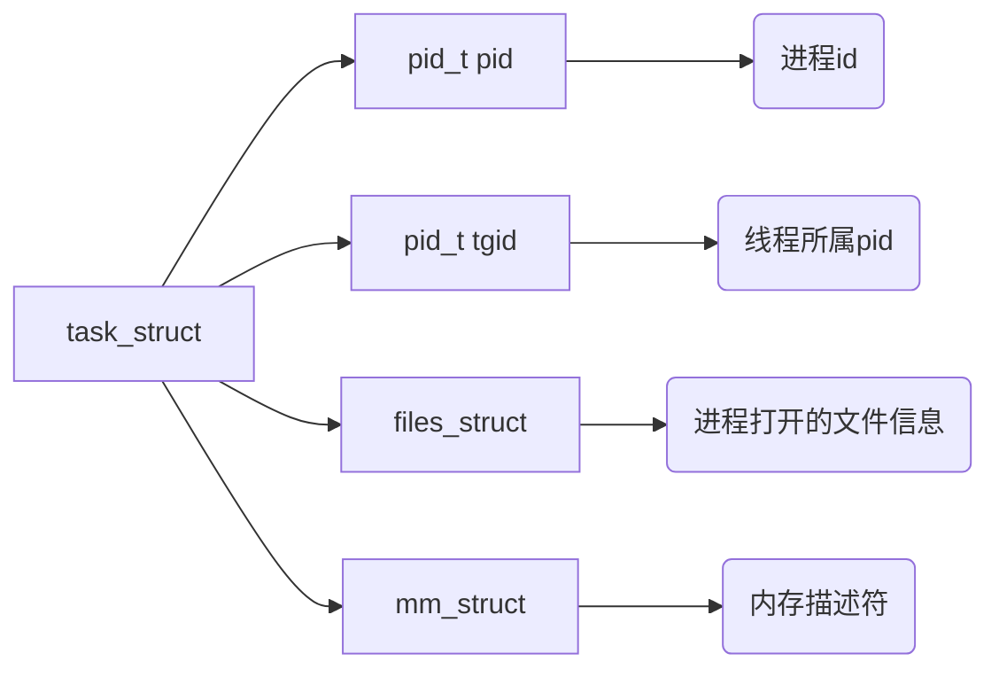

内核如果管理虚拟内存区域？task_struct结构体是什么？

## 1. task_struct



task_struct创建流程：

1. 调用fork()函数创建进程的时候，会创建task_struct;
2. 通过 `copy_process`函数，用父进程的资源，填充新进程task_struct结构；

其中拷贝信息包括mm_struct结构，并且子进程在新创建出来之后他的虚拟内存空间和父进程虚拟内存空间是一摸一样的。

### 1.1 进程和线程的区别

- 进程：是程序的一次执行实例，是操作系统资源分配的基本单位，每个进程都拥有独立的虚拟地址空间，相互隔离；
- 线程：是进程内的一个执行单元，是CPU调度的基本单位，同一进程的线程共享进程的资源，但拥有独立的栈，程序计数器和寄存器。

进程之间的通信

- 管道
- 共享内存
- 消息队列

线程之间的通信

- 同一进程的线程共享代码，数据，文件等资源，通信可以直接读写共享变；
- 线程间同步需要使用锁，避免数据竞争；

### 1.2 进程和线程的底层区别

- 底层区别是创建线程和进程的流程是一致的，只是他们是创建子进程时的两个分支；
- 进程：如果是通过fork系统调用创建出的子进程，它的虚拟内存空间以及相关页表相当于父进程虚拟内存空间的一份拷贝；
- 线程：如果是通过vfork或clone系统调用创建出的子进程，会将父进程的虚拟内存空间以及相关页表直接赋值给子进程，即父子进程的虚拟内存空间变为共享，此时不是一份拷贝。
- 对Linux内核来说，线程仅仅是一个共享特定资源的进程而已。

### 1.3 内核线程和用户线程的区别

- 内核线程和用户线程的区别是内核线程没有相关的内存描述符mm_struct，内核线程对应的tsak_struct结构中的mm_struct为空；
- 当内核线程被调度的时候，内核线程不会访问用户态内存，只会访问内核态内存；
- 由于内核态内存所有线程都相同，内核将调度之前的用户态进程的虚拟内存空间的mm_struct直接赋值给内存线程，从而避免为内核线程分配mm_struct和相关页表的开销，以及避免内核线程之间调度时地址空间切换的开销。

## 2. mm_struct

每个进程都有唯一的mm_struct结构体，用于描述进程虚拟空间。

```cpp
struct mm_struct {
    unsigned long task_size;    /* size of task vm space */
    unsigned long start_code, end_code, start_data, end_data;
    unsigned long start_brk, brk, start_stack;
    unsigned long arg_start, arg_end, env_start, env_end;
    unsigned long mmap_base;  /* base of mmap area */
    unsigned long total_vm;    /* Total pages mapped */
    unsigned long locked_vm;  /* Pages that have PG_mlocked set */
    unsigned long pinned_vm;  /* Refcount permanently increased */
    unsigned long data_vm;    /* VM_WRITE & ~VM_SHARED & ~VM_STACK */
    unsigned long exec_vm;    /* VM_EXEC & ~VM_WRITE & ~VM_STACK */
    unsigned long stack_vm;    /* VM_STACK */

       ...... 省略 ........
}

```

### 2.1 task_size

task_size定义了用户空间和内核空间的分界线：

- 32位中：task_size = 0xC000 0000
- 64位中：task_size = 0x0000 7FFF FFFF F000

### 2.2 代码段

- start_code：定义代码段的起始位置；
- end_code：定义代码段的结束位置；

### 2.3 数据段

- start_data：数据段的起始位置；
- end_data：数据段的结束位置（也是BSS段的起始位置）；

### 2.4 BSS段

- end_data：BSS段的起始位置；
- start_brk：BSS段的结束位置（也是堆的起始位置）；

### 2.5 堆

- start_brk：堆的起始位置；
- brk：当前堆的结束位置（堆中的内存地址的增长方向是由低地址向高地址增长）；

### 2.6 文件映射与匿名映射区

- mmap_base：内存映射区的起始地址（内存映射区地址的增长方向是由高地址向低地址增长）；

### 2.7 栈

- start_stack：栈的起始地址（栈中的内存地址的增长方向是由高地址向低地址增长，和文件映射区一致）；
- 栈的起始位置在RBP寄存器中存储，栈的结束位置即栈顶指针在RSP寄存器中存储；

### 2.8 其他参数

- arg_start/arg_end：描述参数列表的位置，位于栈中最高地址处；
- env_start/env_end：描述环境变量的位置，位于栈中最高地址处；
- total_vm：描述在进程虚拟内存空间中，总共与物理内存映射的页数；
- locked_vm：内存回收时，被锁定不能换出的内存页总数；
- pinned_vm：内存回收时，既不能换出也不能移动的内存页总数；
- data_vm：描述数据段中映射的内存页数目；
- exec_vm：描述代码段中存放可执行文件的内存页数目；
- stack_vm：描述栈中映射的内存页数目；

## 3. vm_area_struct

```cpp
struct vm_area_struct {

	unsigned long vm_start;		/* Our start address within vm_mm. */
	unsigned long vm_end;		/* The first byte after our end address
					   within vm_mm. */
	/*
	 * Access permissions of this VMA.
	 */
	pgprot_t vm_page_prot;
	unsigned long vm_flags;

	struct anon_vma *anon_vma;	/* Serialized by page_table_lock */
    struct file * vm_file;		/* File we map to (can be NULL). */
	unsigned long vm_pgoff;		/* Offset (within vm_file) in PAGE_SIZE
					   units */
	void * vm_private_data;		/* was vm_pte (shared mem) */
	/* Function pointers to deal with this struct. */
	const struct vm_operations_struct *vm_ops;
}

```

### 3.1 虚拟内存区域

- vm_start：指向vm_area_struct描述的这块虚拟内存区域的起始位置；
- vm_end：指向vm_area_struct描述的这块虚拟内存区域的结束位置；
- 虚拟内存区域，是用一个双向链表进行管理的，vm_area_struct内部定义了vm_next和vm_prev指针，用来指向上一个和下一个虚拟内存区域；
- 也不一定，也可能是是用红黑树进行管理的，因为红黑树查找更高效，使用红黑树进行管理的话，每一个虚拟内存区域都是红黑树的一个节点；
- 实际上，内核关于虚拟内存区域的管理是由两种方式的，定义了一个mmap指针用于双向列表的管理，同时定义了一个mm_rb指针用于红黑树的管理；

### 3.2 vm_page_prot

vm_page_prot是一个具体的概念，用于定义底层页表项（PTE）中的访问控制权限，直接应用于内存页级别，决定单个物理页的读写，执行等属性；

什么是底层页表项？

- 底层页表项（PTE）是操作系统内存管理中的核心数据结构，用于实现虚拟地址到物理地址的映射，并控制访问权限；
- 每个PTE记录一个虚拟页与物理页框的映射关系；
- Linux等现代操作系统中，页表通常采用多级结构，底层页表项是最末级的条目，直接指向物理页框；

页表项组成：

- 物理页框号：虚拟页对应的物理内存地址；
- 权限位：控制读，写，执行权限；
- 状态位：
  - 存在位：标记该页是否已经加载到物理内存；
  - 脏位：标记该页是否被修改过，如果是脏页则需要写回磁盘；
  - 访问页：标记该页是否被访问过，用于页面置换算法；
- 其他标志：共享位，用户/内核模式位；

工作流程：

- 地址转换：CPU访问虚拟地址时，MMU（内存管理单元）主机查找页表，最终通过PTE（页表项）获取物理地址；
- 缺页异常：若PTE的存在位为0，触发缺页中断，内核分配物理页并更新PTE；
- 权限检查：若访问违反PTE权限位，触发段错误；

### 3.3 vm_flags

vm_flags是一个抽象概念，用于描述整个虚拟内存区域的访问权限和行为规范；

- 通过掩码位（例如VM_READ,VM_WRITE）定义区域的整体属性；
- 影响内存区域的全局行为（例如是否允许换出，是都映射设备IO空间）；
- 不直接操作页表，而是通过转换生成vm_page_prot；

vm_flags有哪些属性设置？

- VM_READ：定义虚拟内存区域是否可读；
- VM_WRITE：定义虚拟内存区域是否可写；
- VM_EXEC：定义虚拟内存区域是否可执行；
- VM_SHARD：定义虚拟内存区域是否可以在多进程之间共享，以便完成进程间通讯；
- VM_IO：表示这块虚拟内存区域可以映射到设备IO空间，通常在设备驱动程序执行mmap进程IO空间映射时设置；
- VM_RESERVED：表示在内存紧张的时候，这块虚拟内存很重要不能被换出；
- VM_SEQ_READ：用于暗示内核，应用程序对这块虚拟内存区域采用顺序读的方式，内核可根据实际情况决定预读后续的内存页数，加快下次顺序访问速度；
- VM_RAND_READ：用于暗示内核，应用应用程序对这块虚拟内存区域采用随机读的方式，内核可根据实际情况减少预读的内存页数，或者停止预读；

### 3.4 vm_ops

```cpp
struct vm_operations_struct {
	void (*open)(struct vm_area_struct * area);
	void (*close)(struct vm_area_struct * area);
	vm_fault_t (*fault)(struct vm_fault *vmf);
	vm_fault_t (*page_mkwrite)(struct vm_fault *vmf);
    	..... 省略 .......
}

```

以上是针对虚拟内存区域的相关操作的函数指针：

- open：在创建或扩展虚拟内存区域的时候调用，用于初始化虚拟内存区域的私有数据或资源，例如当进行文件映射（mmap）时，若虚拟内存区域是新创建的，内核会调用open初始化文件缓存或计数器；
- close：在销毁或收缩虚拟内存区域的时候调用，例如当用户调用munmap或者进程退出的时候，内核遍历所有虚拟内存区域并调用close；
- fault：当进程访问虚拟内存时，访问的页面不在物理内存中，可能时未分配物理内存也可能时被置换到磁盘中，这个时候就会产生缺页异常，调用fault函数；
  - 文件映射：从磁盘读取数据到物理页；
  - 匿名映射：分配零页或写时复制页；
- page_mkwrite：在只读页首次被写入时调用，用于处理写时复制或者文件写回；

在内核中，每个特定领域的描述符都会有定义相关的操作。

### 什么是写时复制？

### 什么是文件写回？

## 4. 程序编译后的二进制文件如何映射到虚拟内存空间？

编写好的程序代码，编译之后会生成一个ELF格式的二进制文件，这个二进制文件中包含了程序运行所需要的元信息，比比如程序的机器码，全局变量等。这个ELF格式的二进制文件中的布局和虚拟内存空间中的布局类似，也是一段一段的，只不过在文件中每个段我们称之为section，在虚拟内存空间中我们称之为segment。

### 4.1 ELF二进制文件中的section如何映射到虚拟内存空间？

通过 `load_elf_binary`函数，完成内存的映射：

- 设置虚拟内存空间中的内存映射区域的起始地址；
- 创建并初始化栈对应的vm_area_struct结构，包括栈底指针和栈顶指针；
- 将二进制文件中的代码部分映射到虚拟内存空间中；
- 设置并初始化堆对应的vm_area_struct结构，包括堆的起始地址和结束地址；
- 将进程依赖的动态链接库加载到虚拟内存空间中的内存映射区域；
- 初始化内存描述符mm_struct；

```cpp
static int load_elf_binary(struct linux_binprm *bprm)
{
      ...... 省略 ........
  // 设置虚拟内存空间中的内存映射区域起始地址 mmap_base
  setup_new_exec(bprm);

     ...... 省略 ........
  // 创建并初始化栈对应的 vm_area_struct 结构。
  // 设置 mm->start_stack 就是栈的起始地址也就是栈底，并将 mm->arg_start 是指向栈底的。
  retval = setup_arg_pages(bprm, randomize_stack_top(STACK_TOP),
         executable_stack);

     ...... 省略 ........
  // 将二进制文件中的代码部分映射到虚拟内存空间中
  error = elf_map(bprm->file, load_bias + vaddr, elf_ppnt,
        elf_prot, elf_flags, total_size);

     ...... 省略 ........
 // 创建并初始化堆对应的的 vm_area_struct 结构
 // 设置 current->mm->start_brk = current->mm->brk，设置堆的起始地址 start_brk，结束地址 brk。 起初两者相等表示堆是空的
  retval = set_brk(elf_bss, elf_brk, bss_prot);

     ...... 省略 ........
  // 将进程依赖的动态链接库 .so 文件映射到虚拟内存空间中的内存映射区域
  elf_entry = load_elf_interp(&loc->interp_elf_ex,
              interpreter,
              &interp_map_addr,
              load_bias, interp_elf_phdata);

     ...... 省略 ........
  // 初始化内存描述符 mm_struct
  current->mm->end_code = end_code;
  current->mm->start_code = start_code;
  current->mm->start_data = start_data;
  current->mm->end_data = end_data;
  current->mm->start_stack = bprm->p;

     ...... 省略 ........
}

```

## 5. 内核虚拟内存空间

### 上述是用户态虚拟内存空间？还是说是用户虚拟内存空间，在内核中的管理方式？

### 进程虚拟内存空间在内核中的布局及管理？

### 刚才关注的是0x0000 0000 - 0xC000 0000？现在关注的是0xC000 0000 - 0xFFFF FFFF？

### 5.1 32位

- 3G~3G+896MB：这块内存在虚拟地址空间中被称为直接映射区；在物理内存中被称为：ZONE_DMA和ZONE_NORMAL
  - 这一块的虚拟内存地址直接减去0xC000 0000即得到物理内存地址。
  - 内核同样会为这块空间建立映射页表；
  - 这段896MB大小的物理内存中，前1MB在系统启动的时候被系统占用；
  - 1MB之后的物理内存，存放内核代码段，数据段等，这些信息最开始在一个ELF文件中保存，在系统启动时被加载进内存；
  - 当使用fork系统调用创建进程的时候，内核会创建一系列进程相关的描述符，task_struct，mm_struct，vm_area_struct等，也被保存在直接映射区；
  - 内核栈；
- 3G+896MB~4G：这块内存在虚拟地址空间中有如下划分（动态映射）；在物理内存中被称为：ZONE_HIGHMEM（高端内存）
  - vmalloc动态映射区：vmalloc分配的内存在虚拟内存上是连续的，在物理内存上是不连续的；
  - 永久映射区：允许建立与物理高端内存的长期映射关系；
  - 固定映射：固定映射区中虚拟地址是固定的，而被映射的物理地址是可以改变的，即有些虚拟地址在编译的时候就固定下来了，再内核启动过程中被确定；用来将固定的虚拟内存，映射到指定的物理内存。
  - 临时映射区：用于处理缓存页；

### 5.2 32位Linux虚拟内存空间整体布局（高地址->低地址）

- 内核虚拟内存空间
  - 临时映射区
  - 固定映射区
  - 永久映射区
  - vmalloc动态映射区
  - NORMAL映射区
  - DMA映射区
- 进程虚拟内存空间
  - 栈
  - 文件映射与匿名映射区
  - 堆
  - BSS段
  - 数据段
  - 代码段
  - 保留区

### 5.3 64位Linux虚拟内存空间整体布局（高地址->低地址）

- 内核虚拟内存空间
  - 代码段
  - 虚拟内存映射区
  - vmalloc映射区
  - 直接映射区
- 进程虚拟内存空间
  - 栈
  - 文件映射与匿名映射区
  - 堆
  - BSS段
  - 数据段
  - 代码段
  - 保留区
