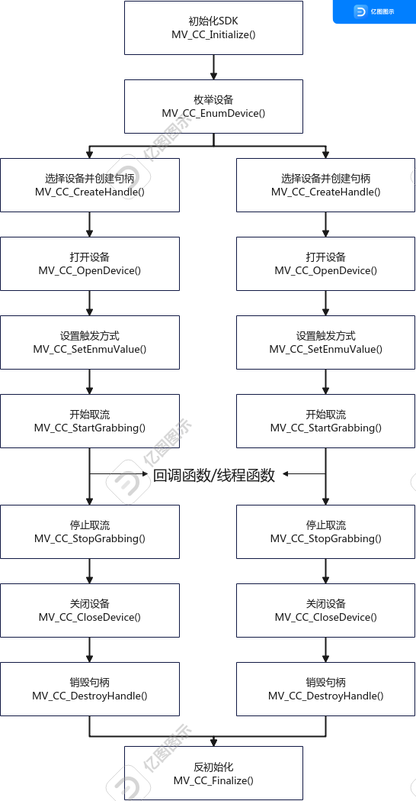

1. 示例代码
2. 相机控制流程
3. 函数用法

<!-- more -->

# code

```cpp
#include <stdio.h>
#include <string.h>
#include <unistd.h>
#include <stdlib.h>
#include <pthread.h>
#include "MvCameraControl.h"

#define CAMERA_NUM             2

bool g_bExit = false;

// 等待用户输入enter键来结束取流或结束程序
// wait for user to input enter to stop grabbing or end the sample program
void PressEnterToExit(void)
{
    int c;
    while ( (c = getchar()) != '\n' && c != EOF );
    fprintf( stderr, "\nPress enter to exit.\n");
    while( getchar() != '\n');
    g_bExit = true;
    sleep(1);
}

bool PrintDeviceInfo(MV_CC_DEVICE_INFO* pstMVDevInfo)
{
    if (NULL == pstMVDevInfo)
    {
        printf("The Pointer of pstMVDevInfo is NULL!\n");
        return false;
    }
    if (pstMVDevInfo->nTLayerType == MV_GIGE_DEVICE)
    {
        int nIp1 = ((pstMVDevInfo->SpecialInfo.stGigEInfo.nCurrentIp & 0xff000000) >> 24);
        int nIp2 = ((pstMVDevInfo->SpecialInfo.stGigEInfo.nCurrentIp & 0x00ff0000) >> 16);
        int nIp3 = ((pstMVDevInfo->SpecialInfo.stGigEInfo.nCurrentIp & 0x0000ff00) >> 8);
        int nIp4 = (pstMVDevInfo->SpecialInfo.stGigEInfo.nCurrentIp & 0x000000ff);

        // ch:打印当前相机ip和用户自定义名字 | en:print current ip and user defined name
        printf("Device Model Name: %s\n", pstMVDevInfo->SpecialInfo.stGigEInfo.chModelName);
        printf("CurrentIp: %d.%d.%d.%d\n" , nIp1, nIp2, nIp3, nIp4);
        printf("UserDefinedName: %s\n\n" , pstMVDevInfo->SpecialInfo.stGigEInfo.chUserDefinedName);
    }
    else if (pstMVDevInfo->nTLayerType == MV_USB_DEVICE)
    {
        printf("Device Model Name: %s\n", pstMVDevInfo->SpecialInfo.stUsb3VInfo.chModelName);
        printf("UserDefinedName: %s\n\n", pstMVDevInfo->SpecialInfo.stUsb3VInfo.chUserDefinedName);
    }
    else if (pstMVDevInfo->nTLayerType == MV_GENTL_GIGE_DEVICE)
    {
        printf("UserDefinedName: %s\n", pstMVDevInfo->SpecialInfo.stGigEInfo.chUserDefinedName);
        printf("Serial Number: %s\n", pstMVDevInfo->SpecialInfo.stGigEInfo.chSerialNumber);
        printf("Model Name: %s\n\n", pstMVDevInfo->SpecialInfo.stGigEInfo.chModelName);
    }
    else if (pstMVDevInfo->nTLayerType == MV_GENTL_CAMERALINK_DEVICE)
    {
        printf("UserDefinedName: %s\n", pstMVDevInfo->SpecialInfo.stCMLInfo.chUserDefinedName);
        printf("Serial Number: %s\n", pstMVDevInfo->SpecialInfo.stCMLInfo.chSerialNumber);
        printf("Model Name: %s\n\n", pstMVDevInfo->SpecialInfo.stCMLInfo.chModelName);
    }
    else if (pstMVDevInfo->nTLayerType == MV_GENTL_CXP_DEVICE)
    {
        printf("UserDefinedName: %s\n", pstMVDevInfo->SpecialInfo.stCXPInfo.chUserDefinedName);
        printf("Serial Number: %s\n", pstMVDevInfo->SpecialInfo.stCXPInfo.chSerialNumber);
        printf("Model Name: %s\n\n", pstMVDevInfo->SpecialInfo.stCXPInfo.chModelName);
    }
    else if (pstMVDevInfo->nTLayerType == MV_GENTL_XOF_DEVICE)
    {
        printf("UserDefinedName: %s\n", pstMVDevInfo->SpecialInfo.stXoFInfo.chUserDefinedName);
        printf("Serial Number: %s\n", pstMVDevInfo->SpecialInfo.stXoFInfo.chSerialNumber);
        printf("Model Name: %s\n\n", pstMVDevInfo->SpecialInfo.stXoFInfo.chModelName);
    }
    else
    {
        printf("Not support.\n");
    }

    return true;
}

static void* WorkThread(void* pUser)
{
    int nRet = MV_OK;

    MVCC_STRINGVALUE stStringValue = {0};
    char camSerialNumber[256] = {0};
    nRet = MV_CC_GetStringValue(pUser, "DeviceSerialNumber", &stStringValue);
    if (MV_OK == nRet)
    {
        memcpy(camSerialNumber, stStringValue.chCurValue, sizeof(stStringValue.chCurValue));
    }
    else
    {
        printf("Get DeviceUserID Failed! nRet = [%x]\n", nRet);
    }

    // ch:获取数据包大小 | en:Get payload size
    MVCC_INTVALUE stParam;
    memset(&stParam, 0, sizeof(MVCC_INTVALUE));
    nRet = MV_CC_GetIntValue(pUser, "PayloadSize", &stParam);
    if (MV_OK != nRet)
    {
        printf("Get PayloadSize fail! nRet [0x%x]\n", nRet);
        return NULL;
    }

    MV_FRAME_OUT_INFO_EX stImageInfo = {0};
    memset(&stImageInfo, 0, sizeof(MV_FRAME_OUT_INFO_EX));
    unsigned char * pData = (unsigned char *)malloc(sizeof(unsigned char) * stParam.nCurValue);
    if (NULL == pData)
    {
        return NULL;
    }
    unsigned int nDataSize = stParam.nCurValue;

    while(1)
    {
		if(g_bExit)
		{
			break;
		}

        nRet = MV_CC_GetOneFrameTimeout(pUser, pData, nDataSize, &stImageInfo, 1000);
        if (nRet == MV_OK)
        {
            printf("Cam Serial Number[%s]:GetOneFrame, Width[%d], Height[%d], nFrameNum[%d]\n", 
                camSerialNumber, stImageInfo.nExtendWidth, stImageInfo.nExtendHeight, stImageInfo.nFrameNum);
        }
        else
        {
            printf("cam[%s]:Get One Frame failed![%x]\n", camSerialNumber, nRet);
        }
    }

    if(pData != NULL)
    {
        free(pData);
        pData = NULL;
    }

    return 0;
}

int main()
{
	int nRet = MV_OK;

    void* handle[CAMERA_NUM] = {NULL};
    do
    {   
        // ch:初始化SDK | en:Initialize SDK
	    nRet = MV_CC_Initialize();
	    if (MV_OK != nRet)
	    {
		    printf("Initialize SDK fail! nRet [0x%x]\n", nRet);
		    return nRet;
	    }

        MV_CC_DEVICE_INFO_LIST stDeviceList;
        memset(&stDeviceList, 0, sizeof(MV_CC_DEVICE_INFO_LIST));

        // 枚举设备
        // enum device
        nRet = MV_CC_EnumDevices(MV_GIGE_DEVICE | MV_USB_DEVICE | MV_GENTL_CAMERALINK_DEVICE | MV_GENTL_CXP_DEVICE | MV_GENTL_XOF_DEVICE, &stDeviceList);
        if (MV_OK != nRet)
        {
            printf("MV_CC_EnumDevices fail! nRet [%x]\n", nRet);
            return nRet;
        }
        unsigned int nIndex = 0;
        if (stDeviceList.nDeviceNum > 0)
        {
            for (int i = 0; i < stDeviceList.nDeviceNum; i++)
            {
                printf("[device %d]:\n", i);
                MV_CC_DEVICE_INFO* pDeviceInfo = stDeviceList.pDeviceInfo[i];
                if (NULL == pDeviceInfo)
                {
                    break;
                } 
                PrintDeviceInfo(pDeviceInfo);      
            }  
        } 
        else
        {
            printf("Find No Devices!\n");
            return -1;
        }

        if(stDeviceList.nDeviceNum < CAMERA_NUM)
        {
            printf("only have %d camera\n", stDeviceList.nDeviceNum);
            return -1;
        }

	    // 提示为多相机测试
	    // Tips for multicamera testing
	    printf("Start %d camera Grabbing Image test\n", CAMERA_NUM);

        for(int i = 0; i < CAMERA_NUM; i++)
        {
            printf("Please Input Camera Index: ");
            scanf("%d", &nIndex);

            // 选择设备并创建句柄
            // select device and create handle
            nRet = MV_CC_CreateHandle(&handle[i], stDeviceList.pDeviceInfo[nIndex]);
            if (MV_OK != nRet)
            {
                printf("MV_CC_CreateHandle fail! nRet [%x]\n", nRet);
                break;
            }

            // 打开设备
            // open device
            nRet = MV_CC_OpenDevice(handle[i]);
            if (MV_OK != nRet)
            {
                printf("MV_CC_OpenDevice fail! nRet [%x]\n", nRet);
                break;
            }

            // ch:探测网络最佳包大小(只对GigE相机有效) | en:Detection network optimal package size(It only works for the GigE camera)
            if (stDeviceList.pDeviceInfo[nIndex]->nTLayerType == MV_GIGE_DEVICE)
            {
                int nPacketSize = MV_CC_GetOptimalPacketSize(handle[i]);
                if (nPacketSize > 0)
                {
                    nRet = MV_CC_SetIntValueEx(handle[i],"GevSCPSPacketSize",nPacketSize);
                    if(nRet != MV_OK)
                    {
                        printf("Warning: Set Packet Size fail nRet [0x%x]!\n", nRet);
                    }
                }
                else
                {
                    printf("Warning: Get Packet Size fail nRet [0x%x]!\n", nPacketSize);
                }
            }
        }

        for(int i = 0; i < CAMERA_NUM; i++)
        {
            // 设置触发模式为off
            // set trigger mode as off
            nRet = MV_CC_SetEnumValue(handle[i], "TriggerMode", MV_TRIGGER_MODE_OFF);
            if (MV_OK != nRet)
            {
                printf("Cam[%d]: MV_CC_SetTriggerMode fail! nRet [%x]\n", i, nRet);
            }

            // 开始取流
            // start grab image
            nRet = MV_CC_StartGrabbing(handle[i]);
            if (MV_OK != nRet)
            {
                printf("Cam[%d]: MV_CC_StartGrabbing fail! nRet [%x]\n",i, nRet);
                break;
            }

            pthread_t nThreadID;
            nRet = pthread_create(&nThreadID, NULL ,WorkThread , handle[i]);
            if (nRet != 0)
            {
                printf("Cam[%d]: thread create failed.ret = %d\n",i, nRet);
                break;
            }
        }

        PressEnterToExit();

        for(int i = 0; i < CAMERA_NUM; i++)
        {
            // 停止取流
            // end grab image
            nRet = MV_CC_StopGrabbing(handle[i]);
            if (MV_OK != nRet)
            {
                printf("MV_CC_StopGrabbing fail! nRet [%x]\n", nRet);
                break;
            }

            // 关闭设备
            // close device
            nRet = MV_CC_CloseDevice(handle[i]);
            if (MV_OK != nRet)
            {
                printf("MV_CC_CloseDevice fail! nRet [%x]\n", nRet);
                break;
            }

            // 销毁句柄
            // destroy handle
            nRet = MV_CC_DestroyHandle(handle[i]);
            if (MV_OK != nRet)
            {
                printf("MV_CC_DestroyHandle fail! nRet [%x]\n", nRet);
                break;
            }

            handle[i] = NULL;
        }
    }while(0);

    for(int i = 0; i < CAMERA_NUM; i++)
    {
        if(handle[i]!=NULL)
        {
            MV_CC_DestroyHandle(handle[i]);
            handle[i] = NULL;
        }
    }

    // ch:反初始化SDK | en:Finalize SDK
	MV_CC_Finalize();

    printf("exit\n");
    return 0;
}
```


# 代码流程




# 函数用法

```cpp
/********************************************************************//**
 *  @~chinese
 *  @brief  创建设备句柄
 *  @param  handle                      [IN][OUT]       设备句柄
 *  @param  pstDevInfo                  [IN]            设备信息结构体
 *  @return 成功，返回MV_OK；错误，返回错误码 
 *  @remarks 根据输入的设备信息，创建库内部必须的资源和初始化内部模块
             通过该接口创建句柄，调用SDK接口，会默认生成SDK日志文件，如果不需要生成日志文件，可以将日志配置文件中的日志等级改成off
 
 *  @~english
 *  @brief  Create Device Handle
 *  @param  handle                      [IN][OUT]       Device handle
 *  @param  pstDevInfo                  [IN]            Device Information Structure
 *  @return Success, return MV_OK. Failure, return error code
 *  @remarks Create required resources within library and initialize internal module according to input device information. 
             By creating a handle through this interface and calling the SDK interface, SDK log files will be generated by default. If no log file needs to be generated, the log level in the log configuration file can be changed to off
 ************************************************************************/
MV_CAMCTRL_API int __stdcall MV_CC_CreateHandle(IN OUT void ** handle, IN const MV_CC_DEVICE_INFO* pstDevInfo);
```


# 分析

1. 多相机控制的关键是，利用相机的信息，创建句柄;
2. 句柄是控制相机的关键；
