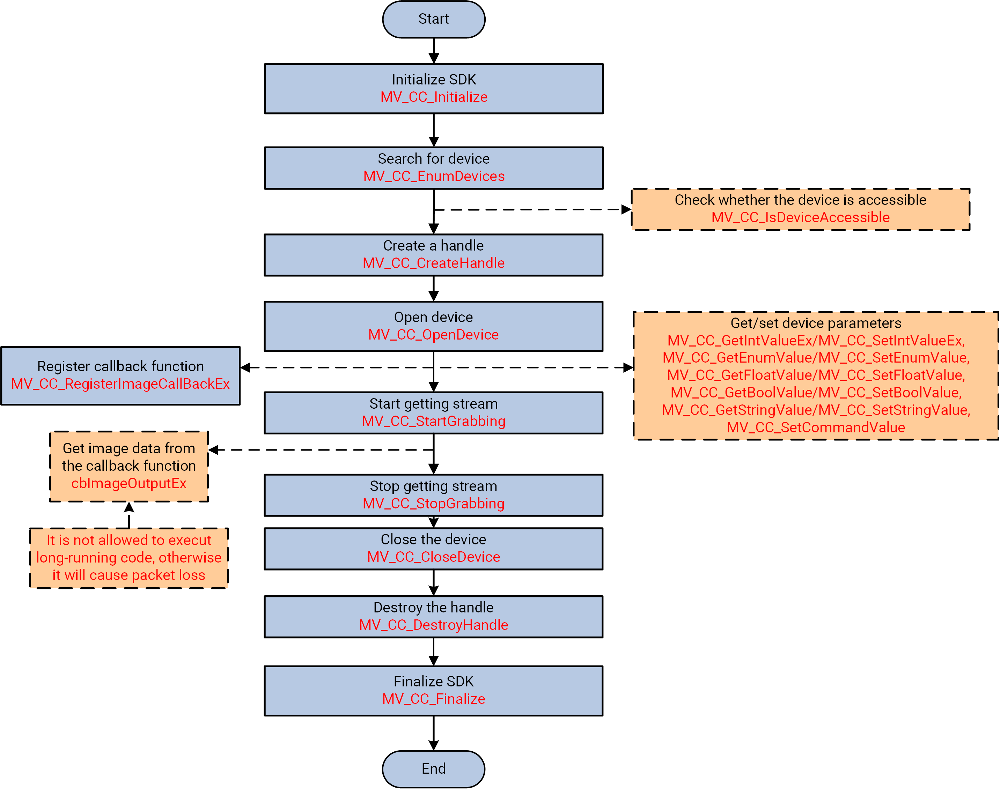

1. 学习使用在回调函数中获取图像
2. 示例代码
3. 控制流程
4. 函数用法

<!-- more -->

# 在回调函数中获取图片

MV_CC_RegisterImageCallBackEx()接口用于注册回调函数，可以自定义回调函数，获取到图片会自动回调。

如果要获取RGB24或BGR24图像，可以调用 MV_CC_RegisterImageCallBackForRGB()或 MV_CC_RegisterImageCallBackForBGR()来注册回调函数。

1. 在回调函数中不建议使用耗时的操作和线程锁，这可能会导致阻塞；
2. pData返回地址指针，建议复制pData的数据以创建另一个线程；

# 示例代码

```cpp
#include <stdio.h>
#include <string.h>
#include <unistd.h>
#include <stdlib.h>
#include "MvCameraControl.h"

// 等待用户输入enter键来结束取流或结束程序
// wait for user to input enter to stop grabbing or end the sample program
void PressEnterToExit(void)
{
    int c;
    while ( (c = getchar()) != '\n' && c != EOF );
    fprintf( stderr, "\nPress enter to exit.\n");
    while( getchar() != '\n');
}

bool PrintDeviceInfo(MV_CC_DEVICE_INFO* pstMVDevInfo)
{
    if (NULL == pstMVDevInfo)
    {
        printf("The Pointer of pstMVDevInfo is NULL!\n");
        return false;
    }
    if (pstMVDevInfo->nTLayerType == MV_GIGE_DEVICE)
    {
        int nIp1 = ((pstMVDevInfo->SpecialInfo.stGigEInfo.nCurrentIp & 0xff000000) >> 24);
        int nIp2 = ((pstMVDevInfo->SpecialInfo.stGigEInfo.nCurrentIp & 0x00ff0000) >> 16);
        int nIp3 = ((pstMVDevInfo->SpecialInfo.stGigEInfo.nCurrentIp & 0x0000ff00) >> 8);
        int nIp4 = (pstMVDevInfo->SpecialInfo.stGigEInfo.nCurrentIp & 0x000000ff);

        // ch:打印当前相机ip和用户自定义名字 | en:print current ip and user defined name
        printf("Device Model Name: %s\n", pstMVDevInfo->SpecialInfo.stGigEInfo.chModelName);
        printf("CurrentIp: %d.%d.%d.%d\n" , nIp1, nIp2, nIp3, nIp4);
        printf("UserDefinedName: %s\n\n" , pstMVDevInfo->SpecialInfo.stGigEInfo.chUserDefinedName);
    }
    else if (pstMVDevInfo->nTLayerType == MV_USB_DEVICE)
    {
        printf("Device Model Name: %s\n", pstMVDevInfo->SpecialInfo.stUsb3VInfo.chModelName);
        printf("UserDefinedName: %s\n\n", pstMVDevInfo->SpecialInfo.stUsb3VInfo.chUserDefinedName);
    }
    else if (pstMVDevInfo->nTLayerType == MV_GENTL_GIGE_DEVICE)
    {
        printf("UserDefinedName: %s\n", pstMVDevInfo->SpecialInfo.stGigEInfo.chUserDefinedName);
        printf("Serial Number: %s\n", pstMVDevInfo->SpecialInfo.stGigEInfo.chSerialNumber);
        printf("Model Name: %s\n\n", pstMVDevInfo->SpecialInfo.stGigEInfo.chModelName);
    }
    else if (pstMVDevInfo->nTLayerType == MV_GENTL_CAMERALINK_DEVICE)
    {
        printf("UserDefinedName: %s\n", pstMVDevInfo->SpecialInfo.stCMLInfo.chUserDefinedName);
        printf("Serial Number: %s\n", pstMVDevInfo->SpecialInfo.stCMLInfo.chSerialNumber);
        printf("Model Name: %s\n\n", pstMVDevInfo->SpecialInfo.stCMLInfo.chModelName);
    }
    else if (pstMVDevInfo->nTLayerType == MV_GENTL_CXP_DEVICE)
    {
        printf("UserDefinedName: %s\n", pstMVDevInfo->SpecialInfo.stCXPInfo.chUserDefinedName);
        printf("Serial Number: %s\n", pstMVDevInfo->SpecialInfo.stCXPInfo.chSerialNumber);
        printf("Model Name: %s\n\n", pstMVDevInfo->SpecialInfo.stCXPInfo.chModelName);
    }
    else if (pstMVDevInfo->nTLayerType == MV_GENTL_XOF_DEVICE)
    {
        printf("UserDefinedName: %s\n", pstMVDevInfo->SpecialInfo.stXoFInfo.chUserDefinedName);
        printf("Serial Number: %s\n", pstMVDevInfo->SpecialInfo.stXoFInfo.chSerialNumber);
        printf("Model Name: %s\n\n", pstMVDevInfo->SpecialInfo.stXoFInfo.chModelName);
    }
    else
    {
        printf("Not support.\n");
    }

    return true;
}


void __stdcall ImageCallBackEx(unsigned char * pData, MV_FRAME_OUT_INFO_EX* pFrameInfo, void* pUser)
{
    if (pFrameInfo)
    {
        printf("GetOneFrame, Width[%d], Height[%d], nFrameNum[%d]\n", 
            pFrameInfo->nExtendWidth, pFrameInfo->nExtendHeight, pFrameInfo->nFrameNum);
    }
}

int main()
{
    int nRet = MV_OK;

    void* handle = NULL;
    do 
    {
        // ch:初始化SDK | en:Initialize SDK
		nRet = MV_CC_Initialize();
		if (MV_OK != nRet)
		{
			printf("Initialize SDK fail! nRet [0x%x]\n", nRet);
			break;
		}

        MV_CC_DEVICE_INFO_LIST stDeviceList;
        memset(&stDeviceList, 0, sizeof(MV_CC_DEVICE_INFO_LIST));

        // 枚举设备
        // enum device
        nRet = MV_CC_EnumDevices(MV_GIGE_DEVICE | MV_USB_DEVICE | MV_GENTL_CAMERALINK_DEVICE | MV_GENTL_CXP_DEVICE | MV_GENTL_XOF_DEVICE, &stDeviceList);
        if (MV_OK != nRet)
        {
            printf("MV_CC_EnumDevices fail! nRet [%x]\n", nRet);
            break;
        }
        if (stDeviceList.nDeviceNum > 0)
        {
            for (int i = 0; i < stDeviceList.nDeviceNum; i++)
            {
                printf("[device %d]:\n", i);
                MV_CC_DEVICE_INFO* pDeviceInfo = stDeviceList.pDeviceInfo[i];
                if (NULL == pDeviceInfo)
                {
                    break;
                } 
                PrintDeviceInfo(pDeviceInfo);        
            }  
        } 
        else
        {
            printf("Find No Devices!\n");
            break;
        }

        printf("Please Intput camera index: ");
        unsigned int nIndex = 0;
        scanf("%d", &nIndex);

        if (nIndex >= stDeviceList.nDeviceNum)
        {
            printf("Intput error!\n");
            break;
        }

        // 选择设备并创建句柄
        // select device and create handle
        nRet = MV_CC_CreateHandle(&handle, stDeviceList.pDeviceInfo[nIndex]);
        if (MV_OK != nRet)
        {
            printf("MV_CC_CreateHandle fail! nRet [%x]\n", nRet);
            break;
        }

        // 打开设备
        // open device
        nRet = MV_CC_OpenDevice(handle);
        if (MV_OK != nRet)
        {
            printf("MV_CC_OpenDevice fail! nRet [%x]\n", nRet);
            break;
        }

        // ch:探测网络最佳包大小(只对GigE相机有效) | en:Detection network optimal package size(It only works for the GigE camera)
        if (stDeviceList.pDeviceInfo[nIndex]->nTLayerType == MV_GIGE_DEVICE)
        {
            int nPacketSize = MV_CC_GetOptimalPacketSize(handle);
            if (nPacketSize > 0)
            {
                nRet = MV_CC_SetIntValueEx(handle,"GevSCPSPacketSize",nPacketSize);
                if(nRet != MV_OK)
                {
                    printf("Warning: Set Packet Size fail nRet [0x%x]!\n", nRet);
                }
            }
            else
            {
                printf("Warning: Get Packet Size fail nRet [0x%x]!\n", nPacketSize);
            }
        }

        // 设置触发模式为off
        // set trigger mode as off
        nRet = MV_CC_SetEnumValue(handle, "TriggerMode", 0);
        if (MV_OK != nRet)
        {
            printf("MV_CC_SetTriggerMode fail! nRet [%x]\n", nRet);
            break;
        }

        // 注册抓图回调
        // register image callback
        nRet = MV_CC_RegisterImageCallBackEx(handle, ImageCallBackEx, handle);
        if (MV_OK != nRet)
        {
            printf("MV_CC_RegisterImageCallBackEx fail! nRet [%x]\n", nRet);
            break; 
        }

        // 开始取流
        // start grab image
        nRet = MV_CC_StartGrabbing(handle);
        if (MV_OK != nRet)
        {
            printf("MV_CC_StartGrabbing fail! nRet [%x]\n", nRet);
            break;
        }

        PressEnterToExit();

        // 停止取流
        // end grab image
        nRet = MV_CC_StopGrabbing(handle);
        if (MV_OK != nRet)
        {
            printf("MV_CC_StopGrabbing fail! nRet [%x]\n", nRet);
            break;
        }

        // 关闭设备
        // close device
        nRet = MV_CC_CloseDevice(handle);
        if (MV_OK != nRet)
        {
            printf("MV_CC_CloseDevice fail! nRet [%x]\n", nRet);
            break;
        }

        // 销毁句柄
        // destroy handle
        nRet = MV_CC_DestroyHandle(handle);
        if (MV_OK != nRet)
        {
            printf("MV_CC_DestroyHandle fail! nRet [%x]\n", nRet);
            break;
        }
        handle = NULL;
    } while (0);

    if (handle != NULL)
    {
        MV_CC_DestroyHandle(handle);
        handle = NULL;
    }


    // ch:反初始化SDK | en:Finalize SDK
	MV_CC_Finalize();

    printf("exit\n");

    return 0;
}

```


# 控制流程



1. 调用MV_CC_Initialize()初始化 SDK 资源;
2. （可选）调用MV_CC_EnumDevices()以枚举子网中与指定传输协议对应的所有设备;找到的设备的信息由pstDevList以 MV_CC_DEVICE_INFO_LIST()结构体返回;
3. （可选）调用MV_CC_IsDeviceAccessible()以检查指定的设备是否可访问，然后再打开它;
4. 调用MV_CC_CreateHandle()以创建设备句柄;
5. （可选）执行以下一项或多项操作来获取/设置不同类型的参数：

   1. [MV_CC_GetIntValueEx()](file:///home/zhm/project/doc/Machine%20Vision%20Camera%20SDK%20Developer%20Guide%20Linux%20(C)%20V4.4.1/html/group___xE5_xB1_x9E_xE6_x80_xA7_xE9_x85_x8D_xE7_xBD_xAE.html#ga6240aac97e206f77b4ce3bd7a1ef1048 "Get the value of camera integer type node.") / [MV_CC_SetIntValueEx()](file:///home/zhm/project/doc/Machine%20Vision%20Camera%20SDK%20Developer%20Guide%20Linux%20(C)%20V4.4.1/html/group___xE5_xB1_x9E_xE6_x80_xA7_xE9_x85_x8D_xE7_xBD_xAE.html#ga9bf0ac21078791974fd4f5b8b2c6328b "Set the value of camera integer type node.")
   2. [MV_CC_GetFloatValue()](file:///home/zhm/project/doc/Machine%20Vision%20Camera%20SDK%20Developer%20Guide%20Linux%20(C)%20V4.4.1/html/group___xE5_xB1_x9E_xE6_x80_xA7_xE9_x85_x8D_xE7_xBD_xAE.html#ga480e49d645f1638ce17da841ac72632c "Get the value of camera float type node.") / [MV_CC_SetFloatValue()](file:///home/zhm/project/doc/Machine%20Vision%20Camera%20SDK%20Developer%20Guide%20Linux%20(C)%20V4.4.1/html/group___xE5_xB1_x9E_xE6_x80_xA7_xE9_x85_x8D_xE7_xBD_xAE.html#gad43ad99b3a3a0ec2e91f6ad1ad4e99ac "Set the value of camera float type node.")
   3. [MV_CC_GetEnumValue()](file:///home/zhm/project/doc/Machine%20Vision%20Camera%20SDK%20Developer%20Guide%20Linux%20(C)%20V4.4.1/html/group___xE5_xB1_x9E_xE6_x80_xA7_xE9_x85_x8D_xE7_xBD_xAE.html#ga2daf898feb1afa4bd5de232d85a33780 "Get the value of camera Enum type node.") / [MV_CC_SetEnumValue()](file:///home/zhm/project/doc/Machine%20Vision%20Camera%20SDK%20Developer%20Guide%20Linux%20(C)%20V4.4.1/html/group___xE5_xB1_x9E_xE6_x80_xA7_xE9_x85_x8D_xE7_xBD_xAE.html#ga15a8abe28a1c5a53e10d115c7def4089 "Set the value of camera Enum type node.")
   4. [MV_CC_GetBoolValue()](file:///home/zhm/project/doc/Machine%20Vision%20Camera%20SDK%20Developer%20Guide%20Linux%20(C)%20V4.4.1/html/group___xE5_xB1_x9E_xE6_x80_xA7_xE9_x85_x8D_xE7_xBD_xAE.html#ga23ceabb8e0caf522ae7f77ad8c14cd84 "Get the value of camera bool type node.") / [MV_CC_SetBoolValue()](file:///home/zhm/project/doc/Machine%20Vision%20Camera%20SDK%20Developer%20Guide%20Linux%20(C)%20V4.4.1/html/group___xE5_xB1_x9E_xE6_x80_xA7_xE9_x85_x8D_xE7_xBD_xAE.html#gad725e29bc56fa0eb57dfefb4d8d6ea69 "Set Boolean value.")
   5. [MV_CC_GetStringValue()](file:///home/zhm/project/doc/Machine%20Vision%20Camera%20SDK%20Developer%20Guide%20Linux%20(C)%20V4.4.1/html/group___xE5_xB1_x9E_xE6_x80_xA7_xE9_x85_x8D_xE7_xBD_xAE.html#ga590e5271c688137ea03ab316f2ca2307 "Get the value of camera string type node.") / [MV_CC_SetStringValue()](file:///home/zhm/project/doc/Machine%20Vision%20Camera%20SDK%20Developer%20Guide%20Linux%20(C)%20V4.4.1/html/group___xE5_xB1_x9E_xE6_x80_xA7_xE9_x85_x8D_xE7_xBD_xAE.html#ga3c816d281b3941584a8fa8ebf14feda1 "Set the camera value of string type.")
   6. [MV_CC_SetCommandValue() MV_CC_SetCommandValue()](file:///home/zhm/project/doc/Machine%20Vision%20Camera%20SDK%20Developer%20Guide%20Linux%20(C)%20V4.4.1/html/group___xE5_xB1_x9E_xE6_x80_xA7_xE9_x85_x8D_xE7_xBD_xAE.html#ga1b85d5a9950f315471f4041db36a5c14 "Set the camera Command node.")

      - 所有 open 属性值都可以在 Camera Parameter Nodes 表中找到。该表提供了每个节点的名称、数据类型、取值范围、访问方式和介绍的详细说明
      - 可设置采集模式：设置和获取单帧、多帧和连续采集的采集模式；
      - 可设置触发方式：硬件触发，软件触发；
      - 可设置图像参数：图像宽度和高度、像素格式、帧速率、AIO 偏移、增益、曝光模式、曝光值、亮度、锐度、饱和度、灰度、白平衡、Gamma 值和其他参数；
6. 调用 MV_CC_DisplayOneFrame()输入句柄并开始显示帧；
7. 调用 MV_CC_StopGrabbing()以停止客户获取；
8. 调用 MV_CC_CloseDevice()以关闭设备；
9. 调用 MV_CC_DestroyHandle()销毁 handle 并释放资源；
10. 调用 MV_CC_Finalize()释放 SDK 资源；

# 函数用法

1. 调用 MV_CC_RegisterImageCallBackEx()设置数据回调函数;
2. 调用 MV_CC_StartGrabbing()开始流式传输;
3. 对于原始图像数据，您可以调用 MV_CC_ConvertPixelTypeEx()转换图像像素格式，或调用 MV_CC_SaveImageEx3()将图像转换为 JPEG 或 BMP 格式并另存为文件;
4. 可以在回调函数中保存图像；
