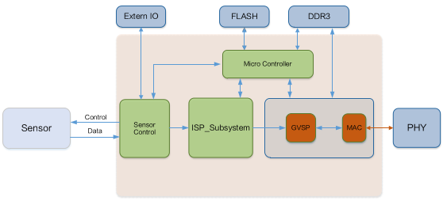

# 相机工作原理

图像传感器接收图像数据后，通过内置的各类ISP图像处理算法完成图像数据处理，最后通过GigE Vision协议完成图像数据传输。

<!-- more -->



图像传感器捕获的原始图像数据就是这些由红、绿、蓝格子组成的图案，它们记录了落在每个像素上的光线强度。但是，由于每个像素只记录一种颜色，我们需要通过ISP中的算法来处理这些数据，以便得到我们最终看到的丰富多彩的图像。

ISP图像处理算法，即Image Signal Processor（影像处理器）算法，是一系列用于处理图像传感器捕获的原始图像数据的算法。这些算法的主要目的是将传感器的原始输出转换成高质量的图像，以供显示或进一步处理。常见的图像处理算法包括：

1. 噪声去除（Noise Reduction） ：去除图像中的噪声，提高图像质量。
2. 坏点去除（Bad Pixel Correction） ：修正传感器中的坏点数据。
3. 去马赛克（Demosaicing） ：将传感器输出的Bayer格式数据转换为RGB数据。
4. 白平衡（Auto White Balance, AWB） ：校正图像的色温，使颜色看起来更自然。
5. 自动曝光控制（Auto Exposure Control） ：调整图像的亮度，以获得最佳的曝光效果。
6. 色彩校正（Color Correction） ：调整图像的色彩，使其更加准确。
7. Gamma校正（Gamma Correction） ：调整图像的亮度曲线，增强图像的对比度。
8. 边缘增强（Edge Enhancement） ：增强图像的边缘，使图像更加清晰。
9. 色彩空间转换（Color Space Conversion） ：将图像从一个色彩空间转换到另一个色彩空间，例如从RGB转换到YUV。
10. HDR/Tone Mapping ：处理高动态范围图像，以在有限的显示设备上显示更广泛的亮度和颜色范围。

### 什么是图像传感器？

图像传感器就像是一个超级小的相机网格，它由成千上万个微小的光敏元件（像素）组成。每个像素都负责捕捉落在它上面的光线，并将其转换成电信号。

### 什么是原始图像数据？

想象一下，你在一个阳光明媚的日子里拿着一个非常特殊的画板在外面画画。这个画板上的每个小格子只能感应一种颜色的光线（红色、绿色或蓝色）。当你完成画作后，每个小格子里只有一种颜色的标记，这些标记就是图像传感器捕获的“原始图像数据”。

### 原始图像数据的例子：

假设你的画板上有一个4x4的格子，每个格子只能感应一种颜色的光线，那么可能看起来像这样：

```
R G R G
G B G B
R G R G
G B G B
```

这里的R代表红色格子，G代表绿色格子，B代表蓝色格子。每个格子只能捕捉相应颜色的光线强度，比如亮红色、深蓝色等。

### 为什么需要处理原始图像数据？

因为每个格子只记录了一种颜色的信息，所以直接看这些数据，你看到的图像会是模糊不清的，像是马赛克一样。为了让图像变得清晰和多彩，我们需要用一些算法来“猜测”每个格子缺失的颜色信息，这个过程叫做去马赛克（Demosaicing）或解拜耳（Bayer Decoding）。

### 去马赛克的例子：

假设我们通过某种算法“猜测”出了缺失的颜色信息，那么刚才的4x4格子可能变成了这样：

```
红 绿 红 绿
绿 蓝 绿 蓝
红 绿 红 绿
绿 蓝 绿 蓝
```

现在每个格子都有了完整的颜色信息，看起来就像是一个正常的图像了。


# 增益

相机增益分为模拟增益和数字增益，模拟增益可将模拟信号放大；数字信号可将模数转换后的信号放大；

增益数值越高时，图像亮度也越高，同时图像噪声也会增加，对图像质量有所影响。且数字增益的噪声会比模拟增益的噪声更明显；

若需要提高图像亮度，建议先增大相机的曝光时间；若曝光时间达不到环境允许的上限不能满足要求，再考虑模拟增益；若模拟增益为最大值还不能满足要求，最后再调整数字增益；


# Gamma矫正

通常相机芯片的输出与照射在芯片感光面的光子是线性的，Gamma 校正提供了一种输出非线性的映射机制；

Gamma校正是一个非线性操作，它通过调整输入信号的功率来改变输出信号的亮度：

* Gamma < 1 ：图像被压缩，暗部细节增强，亮部细节减少，图像整体变暗。
* Gamma = 1 ：图像没有变化，这是线性响应，意味着输入和输出是直接成比例的。
* Gamma > 1 ：图像被扩展，暗部细节减少，亮部细节增强，图像整体变亮。
