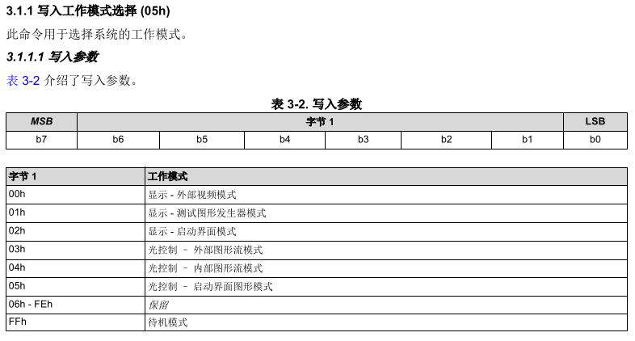
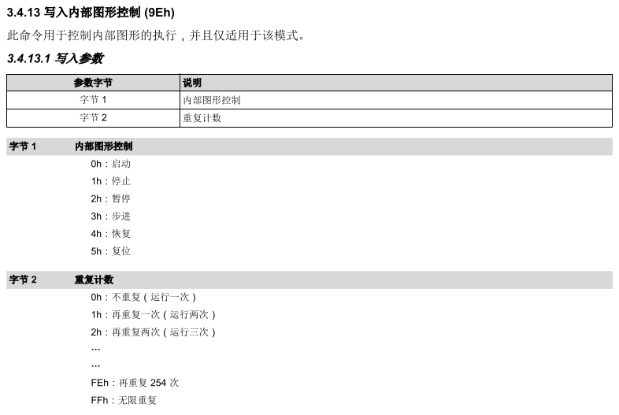

# onceProject

```cpp
bool ProjectorDlpc34xx::project(const bool isContinue) {
    if(!isInitial_) {
        return false;
    }

    if (isContinue) {
        DLPC34XX_WriteOperatingModeSelect(DLPC34XX_OM_SENS_INTERNAL_PATTERN);
        return DLPC34XX_WriteInternalPatternControl(DLPC34XX_PC_START, 0xFF) ==
               SUCCESS;
    } else {
        DLPC34XX_WriteOperatingModeSelect(DLPC34XX_OM_SENS_INTERNAL_PATTERN);
        return DLPC34XX_WriteInternalPatternControl(DLPC34XX_PC_START, 0x0) ==
               SUCCESS;
    }

    return true;
}
```

<!-- more -->

1. `DLPC34XX_WriteOperatingModeSelect(DLPC34XX_OM_SENS_INTERNAL_PATTERN);`选择工作模式

   ```cpp
   uint32_t DLPC34XX_WriteOperatingModeSelect(DLPC34XX_OperatingMode_e OperatingMode)
   {
       uint32_t Status = 0;

       DLPC_COMMON_ClearWriteBuffer();

       DLPC_COMMON_PackOpcode(1, 0x5);
       DLPC_COMMON_PackBytes((uint8_t*)&OperatingMode, 1);

       DLPC_COMMON_SetCommandDestination(0);
       Status = DLPC_COMMON_SendWrite();
       return Status;
   }
   ```



2. 判断是连续投影还是单次投影(由isContinue决定)

   1. isContinue为true为连续投影
   2. isContinue为false为单次投影

   
3. `DLPC34XX_WriteInternalPatternControl(DLPC34XX_PC_START,0xFF)`：发送控制码

   ```cpp
   uint32_t DLPC34XX_WriteInternalPatternControl(DLPC34XX_PatternControl_e PatternControl, uint8_t RepeatCount)
   {
       uint32_t Status = 0;

       DLPC_COMMON_ClearWriteBuffer();

       DLPC_COMMON_PackOpcode(1, 0x9E);
       DLPC_COMMON_PackBytes((uint8_t*)&PatternControl, 1);
       DLPC_COMMON_PackBytes((uint8_t*)&RepeatCount, 1);

       DLPC_COMMON_SetCommandDestination(0);
       Status = DLPC_COMMON_SendWrite();
       return Status;
   }
   ```

`DLPC34XX_WriteInternalPatternControl()`函数即内部图形控制函数，通过这个函数控制内部投影模式。所以在函数内部，会先发送一个 `0x9E`表示为写入内部控制。

# pause


```cpp
bool ProjectorDlpc34xx::pause() {
    if(!isInitial_) {
        return false;
    }

    return DLPC34XX_WriteInternalPatternControl(DLPC34XX_PC_PAUSE, 0xff) ==
           SUCCESS;
}
```

1. **启动（Start）**：

   - 功能：开始显示图形顺序表中的第一个条目。
   - 参数：字节2用于指示在首次执行后重复执行图形顺序表的次数。
   - 用途：用于初始化显示流程，可以设置循环次数，适用于需要循环显示的场景。
2. **停止（Stop）**：

   - 功能：停止执行图形顺序表并关闭照明器。
   - 用途：用于终止显示流程，适用于需要立即停止显示的情况。
3. **暂停（Pause）**：

   - 功能：暂停执行当前的图形顺序表条目，继续显示最后显示的图形。
   - 用途：用于在需要时临时中断显示流程，但保留当前显示状态，适用于需要临时中断或审查当前显示内容的场景。
4. **步进（Step）**：

   - 功能：前往当前所显示图形顺序表中的下一个图形，此操作假定用户已暂停系统。
   - 用途：用于手动控制显示流程，逐个查看图形顺序表中的条目，适用于需要逐个审查或调整显示内容的场景。
5. **恢复（Resume）**：

   - 功能：继续执行当前的图形顺序表条目，此操作假定用户已暂停系统。
   - 用途：用于在暂停后继续显示流程，适用于需要在中断后恢复显示的场景。
6. **复位（Reset）**：

   - 功能：开始显示当前图形顺序表中引用的第一个图形。
   - 用途：用于重置显示流程到初始状态，适用于需要从头开始显示或重新初始化显示内容的场景。
