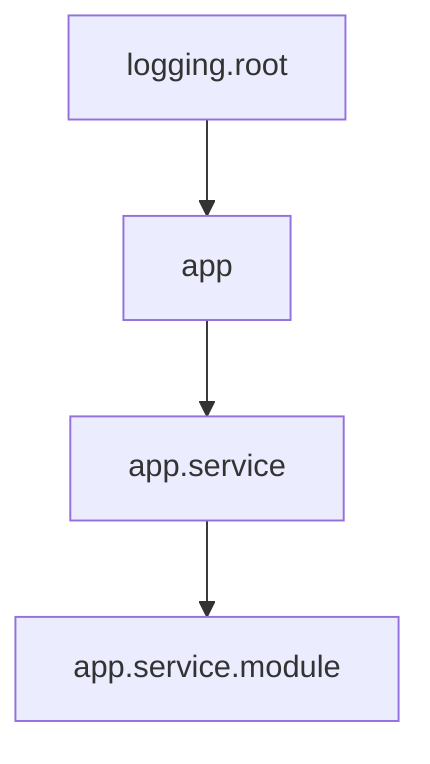

下面我将详细解析你提供的 `LogManager` 类代码，并全面补充 Python 的 logging 系统知识。文章分为两部分：代码解析和 logging 系统详解。

---

### 第一部分：代码解析

#### 1. 类初始化 `__init__`

```
def __init__(self, test_id, log_dir="logs"):
    self.test_id = test_id
    self.log_dir = os.path.join(log_dir, test_id)
    os.makedirs(self.log_dir, exist_ok=True)
    self._init_loggers()
```

* **作用**：创建测试专属的日志目录
* **关键语法**：
  * `os.makedirs(..., exist_ok=True)`：递归创建目录，存在时不报错
  * 路径拼接使用 `os.path.join()` 确保跨平台兼容性

#### 2. 日志初始化 `_init_loggers`

```
def _init_loggers(self):
    # 系统监控日志
    self.sys_logger = logging.getLogger('system_monitor')
    sys_handler = RotatingFileHandler(..., maxBytes=10 * 1024 * 1024, backupCount=3)
    self.sys_logger.addHandler(sys_handler)
    self.sys_logger.setLevel(logging.INFO)

    # 服务日志
    self.service_logger = logging.getLogger('vllm_service')
    service_handler = RotatingFileHandler(..., maxBytes=20 * 1024 * 1024, backupCount=5)
    self.service_logger.addHandler(service_handler)

    # 性能日志
    self.perf_logger = logging.getLogger('perf_metrics')
    perf_handler = logging.FileHandler(...)
    self.perf_logger.addHandler(perf_handler)
    # 写入CSV头
    with open(..., 'a') as f:
        f.write("timestamp,request_id,...\n")
```

* **分层设计**：
  1. **系统级**：轮转日志（硬件监控）
  2. **服务级**：轮转日志（vLLM服务事件）
  3. **请求级**：CSV格式（性能指标）
* **关键组件**：
  * `RotatingFileHandler`：自动分割大文件
  * `maxBytes` & `backupCount`：10MB/文件，保留3个备份

#### 3. 系统监控 `capture_system_metrics`

```
def capture_system_metrics(self):
    cpu = psutil.cpu_percent(interval=1)
    mem = psutil.virtual_memory().percent
    gpu_stats = self._get_gpu_stats()
    log_entry = f"CPU: {cpu}% | Memory: {mem}% | GPU: {gpu_stats}"
    self.sys_logger.info(log_entry)
```

* **技术要点**：
  * 使用 `psutil` 获取 CPU/内存数据
  * GPU 监控通过私有方法 `_get_gpu_stats()` 实现

#### 4. GPU监控 `_get_gpu_stats`

```
def _get_gpu_stats(self):
    try:
        result = subprocess.check_output([
            'nvidia-smi', 
            '--query-gpu=utilization.gpu,memory.used',
            '--format=csv,noheader,nounits'
        ])
        return result.decode().strip()
    except Exception as e:
        return f"GPU monitoring error: {str(e)}"
```

* **关键技巧**：
  * `subprocess.check_output()` 执行 shell 命令
  * 错误处理返回监控异常信息
  * `nvidia-smi` 参数说明：
    * `--query-gpu`：指定查询的指标
    * `--format`：控制输出格式（无表头/无单位）

#### 5. 性能日志 `log_performance_metric`

记录单次请求的性能指标

```
def log_performance_metric(self, request_data):
    timestamp = datetime.datetime.now().isoformat()
    log_line = f"{timestamp},{request_data['id']},{request_data['latency']},..."
    self.perf_logger.info(log_line)
```

* **数据结构**：
  ```
  request_data = {
      'id': 'req_001',
      'latency': 0.25,  # 总延迟
      'first_token': 0.05,  # 首包时间
      'ttft': 0.12,  # Time to First Token
      'status': 'success'
  }
  ```
* **ISO 8601**：`isoformat()` 生成标准时间戳

#### 6. 服务事件 `log_vllm_event`

记录vLLM服务事件

```
def log_vllm_event(self, message, level='info'):
    if level == 'error':
        self.service_logger.error(message)
    else:
        self.service_logger.info(message)
```

* **灵活分级**：通过参数动态切换日志级别

---

### 第二部分：Python Logging 系统详解

#### 1. 四大核心组件

| 组件                | 作用       | 示例                                    |
| ------------------- | ---------- | --------------------------------------- |
| **Logger**    | 记录入口   | `logger = logging.getLogger('name')`  |
| **Handler**   | 输出目的地 | `FileHandler`,`RotatingFileHandler` |
| **Filter**    | 日志过滤   | 按级别/内容过滤（较少使用）             |
| **Formatter** | 日志格式   | `'%(asctime)s - %(message)s'`         |

#### 2. 日志级别（从低到高）

| 级别     | 数值 | 使用场景             |
| -------- | ---- | -------------------- |
| DEBUG    | 10   | 调试详细信息         |
| INFO     | 20   | 正常系统消息         |
| WARNING  | 30   | 潜在问题警告         |
| ERROR    | 40   | 功能错误但程序可运行 |
| CRITICAL | 50   | 系统崩溃级错误       |

#### 3. 核心配置方式

```
import logging

# 1. 创建记录器
logger = logging.getLogger('app.service')
logger.setLevel(logging.DEBUG)  # 捕获所有级别

# 2. 创建处理器 (控制台+文件)
console_handler = logging.StreamHandler()
file_handler = logging.FileHandler('app.log')

# 3. 设置格式器
formatter = logging.Formatter(
    '%(asctime)s - %(name)s - %(levelname)s - %(message)s'
)
console_handler.setFormatter(formatter)

# 4. 添加到记录器
logger.addHandler(console_handler)
logger.addHandler(file_handler)

# 5. 记录日志
logger.debug('详细调试信息')
logger.info('服务启动完成')
logger.warning('磁盘空间不足80%')
```

#### 4. 高级处理器类型

| 处理器                       | 特点           | 适用场景     |
| ---------------------------- | -------------- | ------------ |
| `RotatingFileHandler`      | 按大小轮转文件 | 长期运行服务 |
| `TimedRotatingFileHandler` | 按时段轮转     | 日报/月报    |
| `SMTPHandler`              | 邮件发送       | 错误报警     |
| `SysLogHandler`            | 系统日志       | Unix系统集成 |
| `DatagramHandler`          | UDP发送        | 分布式系统   |

#### 5. 日志格式标记符

| 变量              | 描述             | 示例输出            |
| ----------------- | ---------------- | ------------------- |
| `%(asctime)s`   | 人类可读时间     | 2023-10-01 12:00:00 |
| `%(created)f`   | 时间戳（浮点秒） | 1696152000.00       |
| `%(name)s`      | 记录器名称       | `vllm_service`    |
| `%(levelname)s` | 级别名称         | `INFO`            |
| `%(message)s`   | 日志消息内容     | `CPU利用率: 55%`  |
| `%(filename)s`  | 文件名           | `log_manager.py`  |
| `%(funcName)s`  | 函数名           | `_get_gpu_stats`  |

#### 6. 日志继承关系



* 日志器按点号 `.`形成层级
* 子日志器默认继承父配置（级别/处理器）
* 可通过 `logger.propagate = False` 关闭传递

#### 7. 最佳实践

1. **命名规范**：
   ```
   # 推荐 (使用__name__)
   logger = logging.getLogger(__name__)

   # 避免
   logger = logging.getLogger('generic_name')
   ```
2. **配置分离**：
   ```
   # config.py
   LOG_CONFIG = {
       'version': 1,
       'formatters': {
           'detailed': {
               'format': '%(asctime)s %(name)-15s %(levelname)-8s %(message)s'
           }
       },
       'handlers': {
           'file': {
               'class': 'logging.FileHandler',
               'filename': 'app.log',
               'formatter': 'detailed',
           }
       },
       'root': {
           'level': 'INFO',
           'handlers': ['file']
       }
   }

   # main.py
   import logging.config
   logging.config.dictConfig(LOG_CONFIG)
   ```
3. **性能优化**：
   ```
   # 避免在不需要时构建复杂消息
   if logger.isEnabledFor(logging.DEBUG):
       logger.debug(f'解析结果: {resource_intensive_format()}')

   # 使用%格式比f-string高效
   logger.debug('值: %d', 42)  # 惰性求值
   ```

#### 8. 扩展知识

**LogRecord 属性**：

* 包含日志所有元数据
* 可自定义属性：
  ```
  logger = logging.getLogger(__name__)
  logger.setLevel(logging.INFO)
  logger.propagate = False

  # 添加自定义属性
  old_factory = logging.getLogRecordFactory()
  def record_factory(*args, **kwargs):
      record = old_factory(*args, **kwargs)
      record.custom_id = generate_id()  # 自定义逻辑
      return record

  logging.setLogRecordFactory(record_factory)
  ```

**结构化日志**：

```
# 使用第三方库实现JSON日志
import structlog
logger = structlog.get_logger()
logger.info("请求完成", request_id="req-123", latency=0.25)
```

输出：

```
{
  "event": "请求完成",
  "request_id": "req-123",
  "latency": 0.25,
  "timestamp": "2023-10-01T12:00:00Z"
}
```

---

### 总结

1. **代码亮点**：
   * 分层日志设计（系统/服务/请求）
   * 资源监控与日志整合
   * 错误处理完备性
   * 时间戳标准化
2. **建议改进**：
   ```
   # 添加Formatter提升可读性
   formatter = logging.Formatter('%(asctime)s - %(name)s - %(message)s')
   sys_handler.setFormatter(formatter)

   # 为性能日志关闭传播
   self.perf_logger.propagate = False

   # 避免重复写CSV头
   if not os.path.exists(perf_file):
       with open(perf_file, 'w') as f:
           f.write("timestamp,request_id,...\n")
   ```
3. **Logging 核心价值**：
   * 运维：故障排查 & 性能分析
   * 开发：行为追踪 & 状态监控
   * 安全：审计日志 & 异常检测
   * 业务：用户行为分析（需结合结构化日志）

掌握 logging 系统是 Python 开发的核心能力，特别在服务端开发和系统运维领域更是必备技能。
