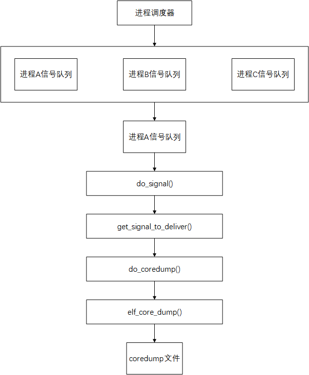

# 什么是coredump

coredump又叫核心转储，是程序崩溃时候的一个内存快照，存储了进程的内存，寄存器状态，运行堆栈等信息。

是一个二进制文件，可以使用以下工具打开分析：

Linux中可以使用：gdb，elfdump，objdump

Windows中可以使用：windebug，solaris下的mdb

<!-- more -->

# 什么时候使用coredump

业务逻辑上的bug，比如参数设置，这种不会导致程序崩溃的错误，使用printf这类输出函数打点调试；

致命操作的bug，比如访问未经申请的内存地址，导致程序崩溃，此时不能使用printf，应该怎么调试呢？

对于必现的bug，一般使用GDB设置断点，逐步执行程序，检查变量和内存，以及回溯调用栈来定位问题。但是对于偶现的bug（多线程竞争，事件相关，资源限制等），由于只在某些特定的条件下发生，所以比较难通过GDB调试，这个时候就可以使用Linux提供的coredump文件进行调试。


# coredump文件生成原理

在程序发生某些错误而导致进程异常退出的时候，Linux内核会根据进程当时的内存信息，生成coredump文件。GDB通过coredump文件可以重现当时的场景，从而定位错误信息。

1. 程序发生错误 -> 产生信号
2. 进程内核检测到对应信号 -> 生成coredump文件

以下信号会导致生成coredump文件：

- SIGILL：非法指令信号
- SIGABRT：由abort()函数发起的信号，用于异常终止程序
- SIGSEGV：无效的内存引用信号，当程序试图访问未分配或不允许访问的内存时
- SIGTRAP：由断点或者某些调试器触发的信号，用于调试目的
- SIGFPE：浮点异常信号，如算术溢出，除以零
- SIGBUG：硬件故障信号，如非法内存访问
- SIGSIS：无效的系统调用信号

当进程从内核态返回到用户态前，内核会检查进程的信号队列中是否有信号没有处理，如果有就调用 `do_signal`内核函数处理信号，流程如下：



## 信号处理do_signal()

```cpp
static void fastcall do_signal(struct pt_regs *regs)
{
    siginfo_t info;
    int signr;
    struct k_sigaction ka;
    sigset_t *oldset;

    ...
    signr = get_signal_to_deliver(&info, &ka, regs, NULL);
    ...
}
```

该函数负责将用户空间的信号传递给进程。其中该函数接收一个指向 `pt_regs`结构的指针作为参数，其中包含了程序计数器、栈指针和所有通用寄存器，这些寄存器在信号处理时被保存。

## 信号获取get_signal_to_deliver()

```cpp
int get_signal_to_deliver(siginfo_t *info, struct k_sigaction *return_ka,
                          struct pt_regs *regs, void *cookie)
{
    sigset_t *mask = &current->blocked;
    int signr = 0;

    ...
    for (;;) {
        ...
        // 1. 从进程信号队列中获取一个信号
        signr = dequeue_signal(current, mask, info); 

        ...
        // 2. 判断是否会生成 coredump 文件的信号
        if (sig_kernel_coredump(signr)) {
            // 3. 调用 do_coredump() 函数生成 coredump 文件
            do_coredump((long)signr, signr, regs);
        }
        ...
    }
    ...
}
```


`get_signal_to_deliver`函数主要完成以下三个工作：

- 调用 `dequeue_signal`函数从进程的信号队列中获取一个信号
- 调用 `sig_kernel_coredump`函数判断信号是否会生成coredump文件
- 如果信号会生成coredump文件，那么就调用 `do_coredump`函数生成coredump文件

## 生成coredump文件

```cpp
int do_coredump(long signr, int exit_code, struct pt_regs *regs)
{
    char corename[CORENAME_MAX_SIZE + 1];
    struct mm_struct *mm = current->mm;
    struct linux_binfmt *binfmt;
    struct inode *inode;
    struct file *file;
    int retval = 0;
    int fsuid = current->fsuid;
    int flag = 0;
    int ispipe = 0;

    binfmt = current->binfmt; // 当前进程所使用的可执行文件格式（如ELF格式）

    ...
    // 1. 判断当前进程可生成的 coredump 文件大小是否受到资源限制
    if (current->signal->rlim[RLIMIT_CORE].rlim_cur < binfmt->min_coredump)
        goto fail_unlock;

    ...
    // 2. 生成 coredump 文件名
    ispipe = format_corename(corename, core_pattern, signr);

    ...
    // 3. 创建 coredump 文件
    file = filp_open(corename, O_CREAT|2|O_NOFOLLOW|O_LARGEFILE|flag, 0600);

    ...
    // 4. 把进程的内存信息写入到 coredump 文件中
    retval = binfmt->core_dump(signr, regs, file);

fail_unlock:
    ...
    return retval;
}
```

`do_coredump`函数主要完成以下四个工作：

- 判断当前进程可生成的coredump文件大小是否收到资源限制
- 如果不受限制调用 `format_corename`生成coredump文件的文件名
- 调用 `filp_open`函数创建coredump文件
- 根据当前进程所使用的可执行文件格式选择相应的方式填充coredump文件的内容
- elf文件格式使用的是 `elf_core_dump`方法

# coredump文件使用指南


# 学习资源

[coredump文件是如何生成的](https://cloud.tencent.com/developer/article/1860631)
[Linux生成coredump的方法及设置](https://www.cnblogs.com/flyinggod/p/13415862.html)
[gdb调试coredump](https://www.cnblogs.com/lidabo/p/14311900.html)
[gdb调试示例-强烈推荐](https://blog.csdn.net/sunxiaopengsun/article/details/72974548)
[debuginfo](https://developers.redhat.com/articles/2022/01/10/gdb-developers-gnu-debugger-tutorial-part-2-all-about-debuginfo#)【这篇文章有很多不明白的名词，涉及到编译器和DWARF调试信息】
[GDB 入门笔记](https://imageslr.com/2023/gdb.html#coredump)【这是一篇非常全面的GDB入门笔记】
[GDB Documentation](https://sourceware.org/gdb/documentation/)【GDB官方文档】
